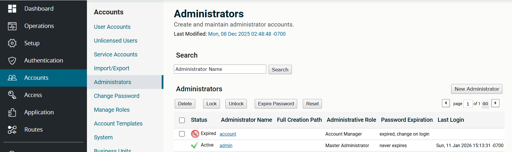
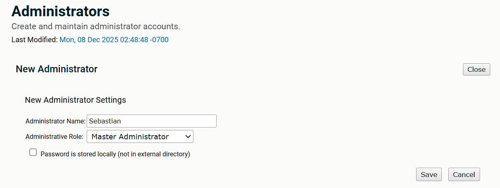

# SecureTransport Basic Administration

---

**Axway University**  
**SecureTransport Installation – Rocky Linux 9**  


---

*Copyright © Axway 2026. All Rights Reserved.*

---

| Average time required to complete this lab | 60 minutes    |
| ---- | ---- |
| Lab last updated | May 2026 |
| Lab last tested | May 2026 |

Welcome to the APIM Installation Lab! In this hands-on session, we'll ........


---

## Table of Contents


- [Exercise 4 – Administrator LDAP](#exercise-4--administrator-ldap)
  - [Task 1: Configure LDAP](#task-1-configure-ldap)
  - [Task 2: Create a new Administrator](#task-2-create-a-new-administrator)
  - [Task 3: Login as the new Administrator](#task-3-login-as-the-new-administrator)

---


## Exercise 4 – Administrator LDAP


### Task 1: Configure LDAP

Go to **Server Configuration** and find the parameter:

```
Plugins.Authentication.admin-ldap-authentication-plugin
```

Add a name for your plugin profile (for example `Default`). Note that the parameter names shown in the table below are based on the profile name you specified. If you decide to use a different name, replace **Default** in the variable names with the profile name you selected.

| Parameter | Value |
| --- | --- |
| `Plugins.Authentication.admin-ldap-authentication-plugin.Default.ldapConnectionType` | `normal` |
| `Plugins.Authentication.admin-ldap-authentication-plugin.Default.ldapHost` | `axwaydemo.com` |
| `Plugins.Authentication.admin-ldap-authentication-plugin.Default.ldapServerName` | `axwaydemo.com` |
| `Plugins.Authentication.admin-ldap-authentication-plugin.Default.ldapPort` | `389` |
| `Plugins.Authentication.admin-ldap-authentication-plugin.Default.ldapServerVersion` | `3` |
| `Plugins.Authentication.admin-ldap-authentication-plugin.Default.ldapUseReferrals` | `true` |
| `Plugins.Authentication.admin-ldap-authentication-plugin.Default.ldapBindDN` | `cn=Administrator,dc=demo.axway,dc=com` |
| `Plugins.Authentication.admin-ldap-authentication-plugin.Default.ldapBaseDN` | `ou=users,dc=demo.axway,dc=com` |
| `Plugins.Authentication.admin-ldap-authentication-plugin.Default.ldapBindPassword` | `axway` |
| `Plugins.Authentication.admin-ldap-authentication-plugin.Default.ldapAuthenticationBindTyp` | `admin` |
| `Plugins.Authentication.admin-ldap-authentication-plugin.Default.ldapSearchFilter` | `sn=${authn.loginname}` |

Your LDAP server configuration is now complete. The next step is to enable the plugin.

Edit *Plugins.Authentication.Admin.Registry*:

- If the field is **empty**, change the value to `LDAP`
- If the field is **not empty**, add `LDAP` on a separate line at the end of the field.

> **Note:** You can also use a different name for your registry. This will change the variable names in the next steps.

In the newly shown fields (note that the names of the fields depend on the name you chose in the previous step so your fields may be different):

| Parameter | Value |
| --- | --- |
| `Plugins.Authentication.Admin.Registry.LDAP.enabled` | `true` |
| `Plugins.Authentication.Admin.Registry.LDAP.plugin` | `admin-ldap-authentication-plugin` |
| `Plugins.Authentication.Admin.Registry.LDAP.conf` | `Default` *(matching the value from the start of the exercise)* |

> **NOTE:** This configuration can also be done via the new Configuration Group settings in the Configuration page using the **Authentication.Plugins.Chain.Group** group.

---

### Task 2: Create a new Administrator

Select **New Administrator** and add *Sebastian* as a Master Administrator.




Save the changes with the **Password is stored locally** option **unchecked**.

---

### Task 3: Login as the new Administrator

If all is correctly configured – you should now be able to log in as administrator:

| | |
| --- | --- |
| **Username** | `Sebastian` |
| **Password** | `sebastian` |

Look at the **Server Log** if you get login failures to help find which parameter has been incorrectly specified – or whether the LDAP server itself has issues.