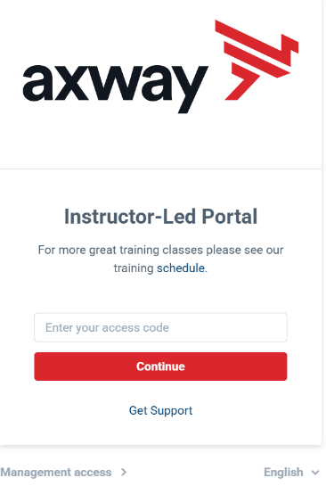
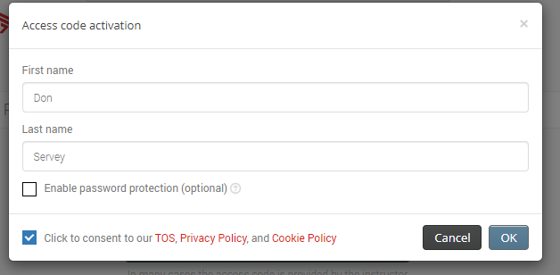
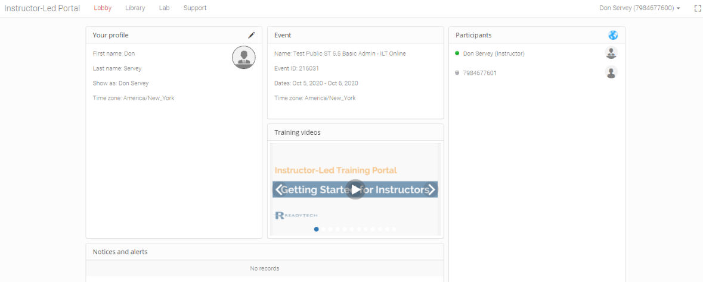
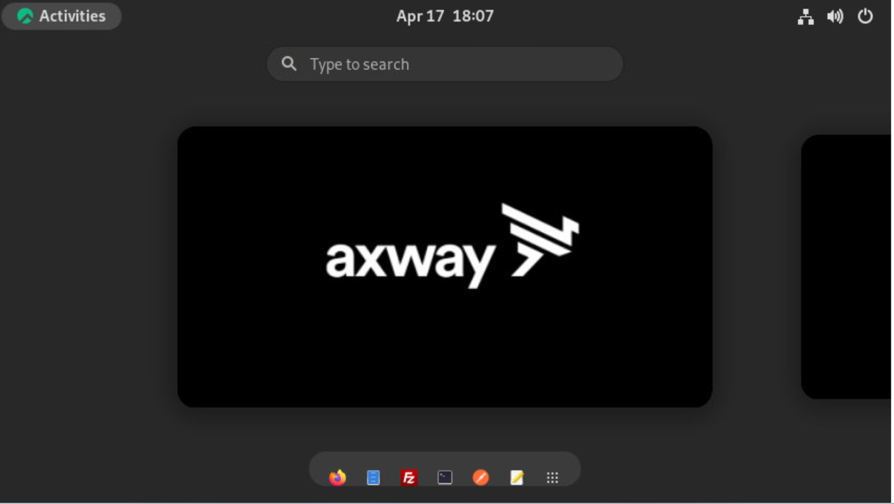
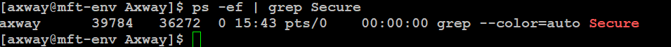
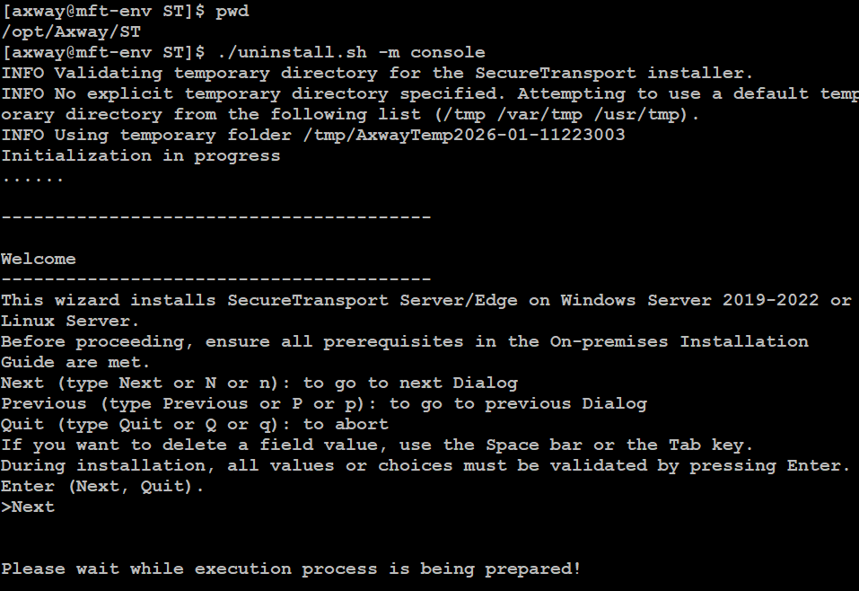

#Axway University
#SecureTransport Installation – Rocky Linux 9##

*Copyright © Axway 2026. All Rights Reserved.*

| Average time required to complete this lab | 60 minutes |
| ---- | ---- |
| Lab last updated | May 2026 |
| Lab last tested | May 2026 |

Welcome to the APIM Installation Lab! In this hands-on session, we'll ........

---

## Table of Contents

- [Exercise 1 – Introduction to the Environment](#exercise-1--introduction-to-the-environment)
  - [Task 1: Access the Training Environment](#task-1-access-the-training-environment)
  - [Task 2: Uninstall SecureTransport](#task-2-uninstall-securetransport)

---

## Exercise 1 – Introduction to the Environment

### About This Exercise

In this exercise, you will be introduced to the SecureTransport environment.

---

### Task 1: Access the Training Environment

**Know your own parameters.**

Each course attendee will have their own unique parameters for use within the labs. These will be shared by the instructor during the class.

In this task, you will connect to the Axway/ReadyTech training environment and log into your training server.

1. Open a browser on your desktop

2. Navigate to `https://axway.instructorled.training`

   

3. Enter the access code provided by your instructor and click *Continue*

4. When logging in for the first time, you will be presented with an access code activation dialog box. Enter your first and last name, check the consent box, and click **OK**.

   

5. Once logged in, you will see the following:

   

6. Click on *Lab* at the top of the screen. You should see this screen:

   

7. Verify that *ReadyTech View (HTML)* is selected in the *Remote desktop* section. Click on **Connect to the lab** in the Remote desktop section

8. Enter `axway` in the *Login* and *Password* fields of the *Log in* dialog box

   

9. At this point you should have access to your lab server desktop

   

> **NOTE:** Click on **Activities** at the top left corner at any time to bring this UI to the front. If there are open applications (such as Firefox, Filezilla and so on), you will see them here as well.

---

### Task 2: Uninstall SecureTransport

Your environment will contain a pre-installed version of SecureTransport.

Our objective will be to remove the already existing installation and install the current version of ST.

**Shutdown SecureTransport if it is already running:**

```bash
cd /opt/Axway/ST/SecureTransport/bin
./stop_all
ps -ef | grep Secure
```

There should be no processes besides the grep process itself:



**Uninstall SecureTransport:**

```bash
cd /opt/Axway/ST
./uninstall.sh -m console
```



Press **Enter** or `y` when prompted.


> **NOTE:** Some versions of ST may throw a warning about missing SLF4J loggers. These warnings can be safely ignored.

If the summary or the status shows any errors, consult the `install.log` file.

