# Axway University
# SecureTransport Installation – Rocky Linux 9

*Copyright © Axway 2026. All Rights Reserved.*


| Average time required to complete this lab | 60 minutes    |
| ---- | ---- |
| Lab last updated | May 2026 |
| Lab last tested | May 2026 |

Welcome to the APIM Installation Lab! In this hands-on session, we'll ........


---

## Table of Contents


- [Exercise 2 – Install SecureTransport](#exercise-2--install-securetransport)
  - [Task 1: Unzip the Installation Kit](#task-1-unzip-the-installation-kit)
  - [Task 2: Begin the Core Server Installation](#task-2-begin-the-core-server-installation)
  - [Task 3: Post Installation Configuration](#task-3-post-installation-configuration)
  - [Task 4: Restart SecureTransport](#task-4-restart-securetransport)
  - [Task 5: Disable the Setup Account](#task-5-disable-the-setup-account)
  - [Task 6: Start the Protocol Daemons if they are not running](#task-6-start-the-protocol-daemons-if-they-are-not-running)

---

## Exercise 2 – Install SecureTransport

We have already performed all pre-installation checks as per the Installation manual.

There are a few versions of the installation kit in the folder `/home/axway/Installers/ST/Install` and the licences required for ST are in the folder `/home/axway/Installers/ST`. Your instructor will let you know which of the provided installers to use.

We'll be performing a **non-root installation** as this follows security best practices.

---

### Task 1: Unzip the Installation Kit

The name of your installation kit will vary as SecureTransport is released on a monthly basis.

Below is only an example (for January 2026) – your file may be named differently:

```bash
unzip SecureTransport_5.5-20260129_Install_linux-x86-64_BN3237.zip
```

---

### Task 2: Begin the Core Server Installation

1. **Run the setup command:**

   ```bash
   ./setup.sh -m console
   ```

   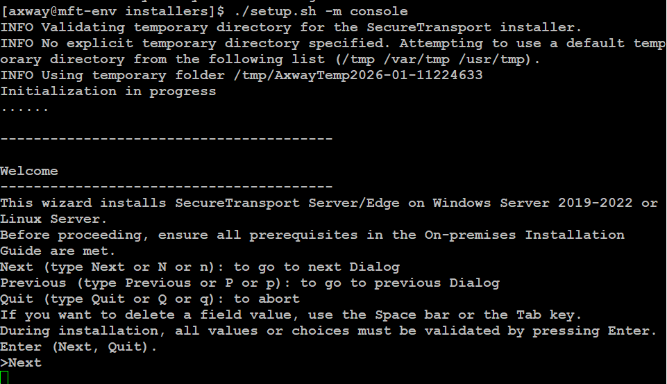

2. **Accept the license**

   > **NOTE:** The number of pages depends on the resolution and the size of your screen and window.

   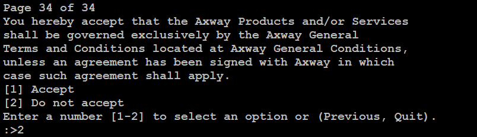

3. **Select the Installation Directory of the Installer Product**

   ```
   Type the option you want to modify: 2
   Type the directory name when prompted: /opt/Axway/ST
   ```

   

4. **Select Server or Edge** — select *Server* for this installation

   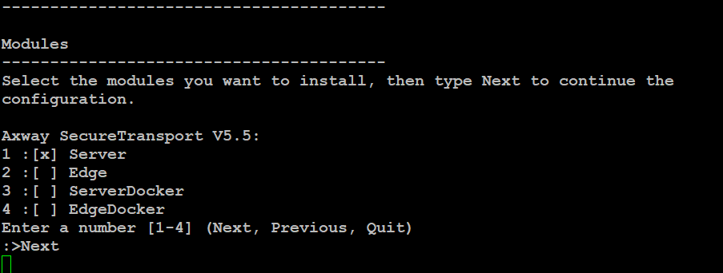

5. **Select the Installation Directory for SecureTransport** — choose the Default for the ST installation directory

   

6. **Select the Database** — select *Embedded Database* for this exercise

   

7. **Installation type** — select *Standalone*

   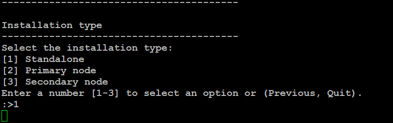

8. **Database settings**

   > **NOTE:** Password is mandatory and cannot be left as the default value. Select `2` and set the password.

   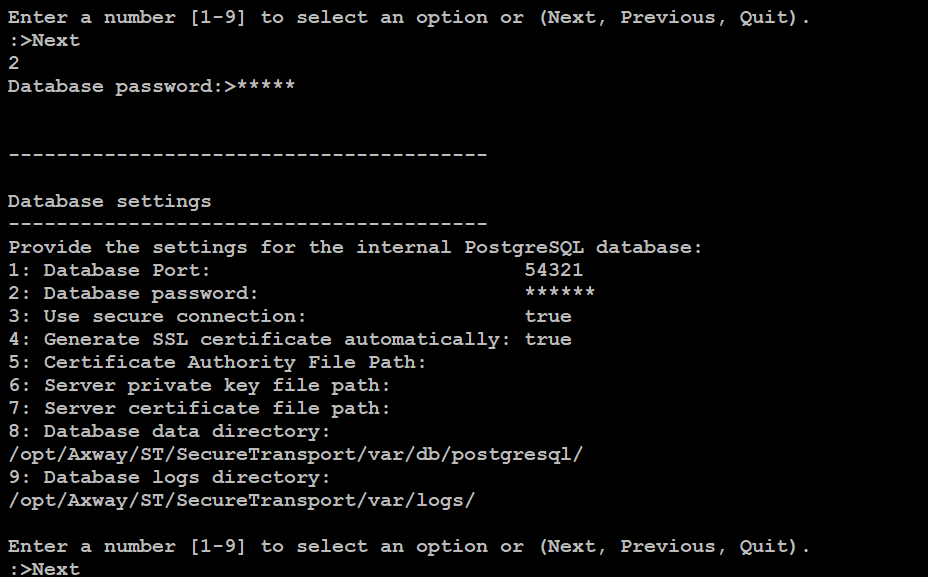

9. **Configuration settings**

   Set `Cluster Auto-Register IP/FQDN` to `mft-env` (Select `5` to update the value).

   Follow the prompts to start the installation after that.

   

10. **Validate the admin interface is running:**

    ```bash
    netstat -an | grep 8444
    ```

    If you changed the Admin port in step 9, use the port you selected there instead of `8444`.

    

Your SecureTransport is now installed, and you can proceed with its configuration.

---

### Task 3: Post Installation Configuration

Your VM has a nodename of `mft-env`.

**Connect to the Admin GUI:**

In a browser, connect to the UI at:

```
https://mft-env:8444
```

> The certificate is not trusted so accept the risks that the browser mentions.

The special *setup* account will walk you through the process – username `setup`, password `setup`.

> **NOTE:** Changing the setup account's password is **mandatory** for security reasons so you will need to change the password before you can proceed.

> **NOTE:** The UIs may look slightly different if you are installing a different version. The below screenshots are for the September 2025 update of ST.


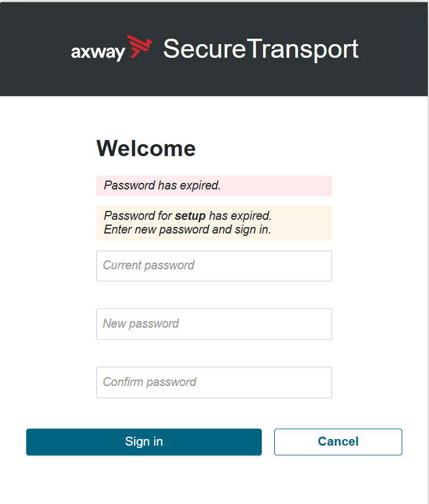

---

**Install the licenses**

Licenses can be found in `/home/axway/Installers/ST`

- **Method 1:** Copy and paste the contents of the files into the GUI and select **Update License** each time.
- **Method 2:** Using the command line and the file system directly – copy the license files to the SecureTransport configuration folder as below:

  ```bash
  cp filedrive.license /opt/Axway/ST/SecureTransport/conf
  cp st.license /opt/Axway/ST/SecureTransport/conf
  ```

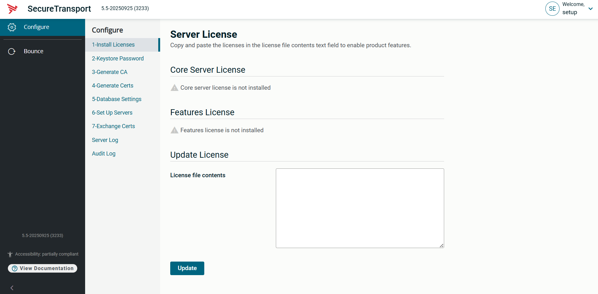
---

**Create the Keystore Password**

Do not enter anything in the "Current password" field.

Ensure that you remember the password you have set! For this exercise, we recommend `Axway123`. However, any password can be used.

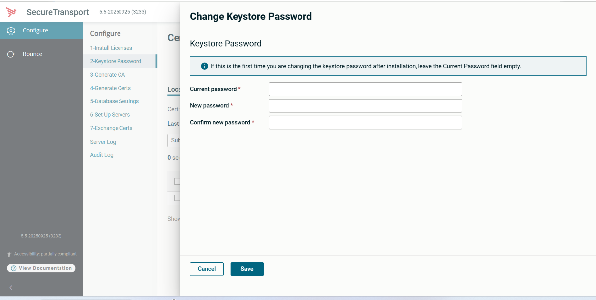

On successful update, the server will show you a green notification on the screen and close the secondary window, returning you to the main page:


---

**Generate a new CA**

During installation, a temporary Certificate Authority (CA) is created. You can either import your own CA certificate from your organization (typically an intermediate certificate with signing attributes) or, for the purposes of this exercise, create a self-signed certificate by selecting ***Generate New Internal CA***. The original CA remains on the server under a new name, ensuring that all certificates signed by it remain valid.

Use the name of your VM – `mft-env` – as the common name.

Select **Generate**. The screen refreshes after the certificate is created and displays briefly a green success message, then closes the secondary window and returns you to the previous screen.

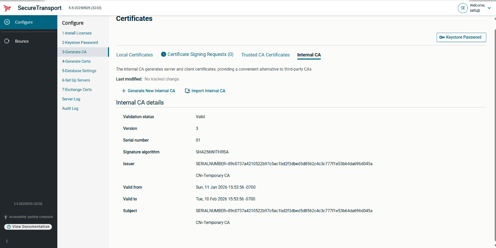
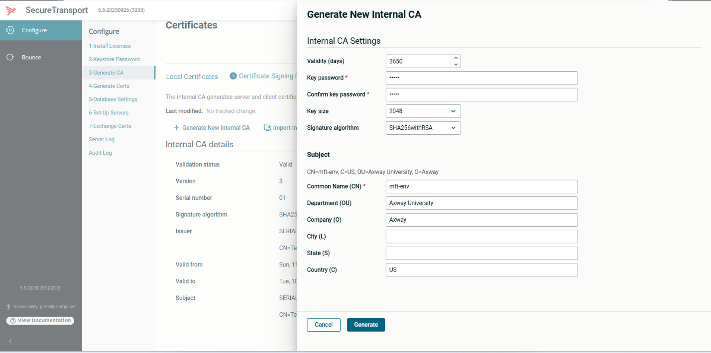

Your internal CA should now look something like this:


---

**Generate Certificates**

Now we need to generate the required certificates. These will all be signed by the new CA.

First, the `admind` certificate. A temporary admind certificate was created at installation time. This certificate is valid for 30 days and was signed by the auto-generated CA. Now, we need to replace it. The admind certificate is the certificate used for the admin GUI you are now using via the browser and cannot be renamed.

> **NOTE:** Never delete the admind certificate.

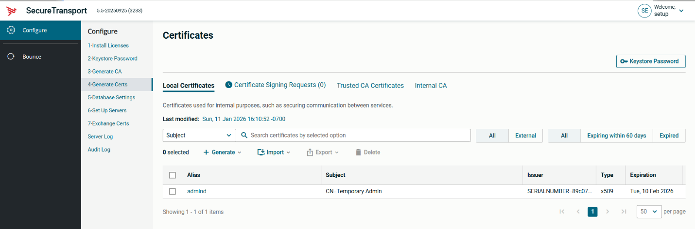

Click on **Generate** and select *X.509 Certificate*:


This will open the screen for generating the new certificate:


You will be asked if you wish to overwrite the existing admind certificate – select **Overwrite**.

> **NOTE:** If you want to preserve the original certificate, export it before you generate the new one.


The screen refreshes after the certificate is created and displays briefly a green success message, then closes the secondary window and returns you to the previous screen which should look like this:

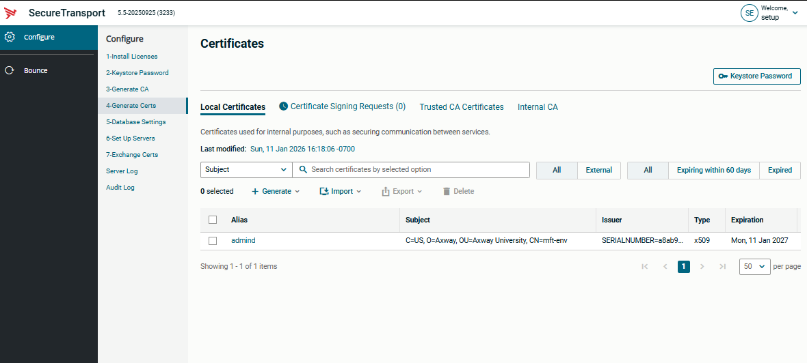

Repeat the above steps to generate the following certificates:

| Alias | Purpose |
| --- | --- |
| `mdn` | Creating the MDNs for all files transferred through the server |
| `streaming` | Securing the communication with any edges you may want to connect |
| `cluster` | Securing the cluster communication if installing more than one server |
| `ssh_server` | Used for the SSH server |
| `ssl_server` | Used for all SSL servers (you can also create separate certificates for each service or import externally signed certificates) |

The result should be something like this:

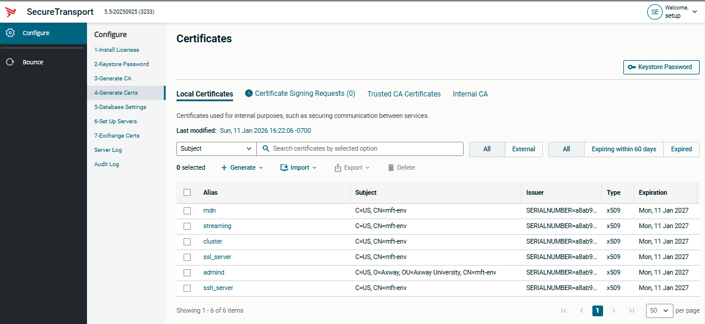

---

**Configure Protocol Daemons**

Now enable the protocol servers for the protocols we'll be using.

First let's enable HTTPS.


Select the ellipsis next to the *"Http Default"* server, then select the **Settings** icon:


This will open the following screen:


In the *"SSL Key Alias"* field in the *SSL Settings* section, select the `ssl_server` certificate we generated previously. This is what will be seen by user clients when they connect to the Web Client interface or the User API. Make sure you enable **HTTPS** and **HSTS**. If you enable HTTP, the listener will be started but you will need to do additional changes to allow your server to accept non-secure connections.


Similarly, enable the SFTP server.

In the *"SSH Key Alias"* field, select the `ssh_server` certificate that was created earlier and make sure you enable both **SFTP** and **SCP**. By default, some weak key exchange algorithms are enabled. You can disable them at this stage or later. If the daemon is already running, this change requires a restart.

---

### Task 4: Restart SecureTransport

Because multiple configuration changes were made, SecureTransport must be shut down completely and restarted.

Command line scripts are found under the `<installationDir>/bin` folder (if you installed in the folder specified in Task 2, your installation directory is `/opt/Axway/ST/SecureTransport`).

```bash
cd /opt/Axway/ST/SecureTransport/bin
./stop_all
```

Verify that all JVMs are stopped:

```bash
ps -ef | grep Secure
```

Now, start up SecureTransport:

```bash
./start_all
```

Verify that the admin is started:

```bash
netstat -an | grep 8444
```

---

### Task 5: Disable the Setup Account

We no longer need the setup account – so login as the normal Master Administrator:

| | |
| --- | --- |
| **URL** | `https://mft-env:8444` |
| **Username** | `admin` |
| **Password** | `admin` |

You will again be forced to change the default admin password. Once you do that, you will see the main dashboard of the server:

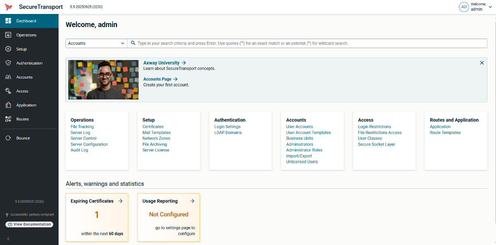

Navigate to **Accounts → Administrators**.


You will see all the default accounts created at installation time.

Delete the **account** and **application** accounts. If you want to explore them instead, their passwords match their names. You can also change their passwords or lock them instead of removing them.

**Lock the setup account.**

> **NOTE:** Please leave the **dbsetup** account intact. You can change its password if you want to (the current password is **dbsetup**).


---

### Task 6: Start the Protocol Daemons if they are not running

As you executed `start_all` earlier in Task 4, the protocol daemons should be already started. This exercise shows you how you can start them from the UI if necessary.

You can start the HTTPS daemon by clicking the top ellipsis menu next to *"HTTP Service"*.


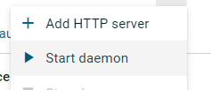

You can start the SSH daemon in a similar manner.

Your Server Control Panel should now look like this:

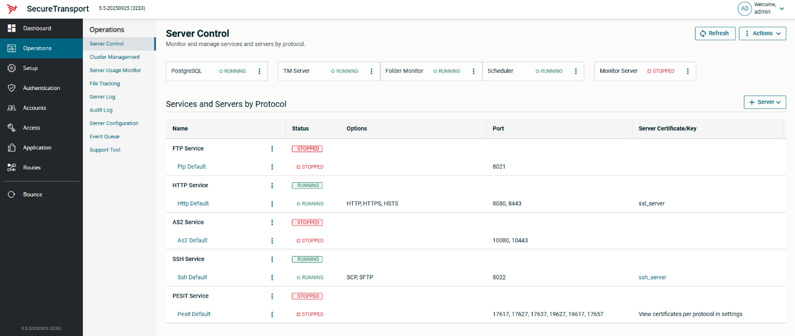

---

