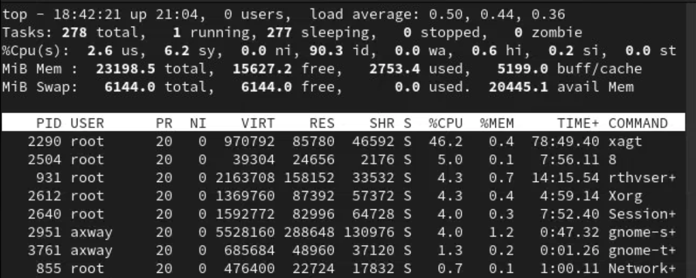

# Axway University
# SecureTransport Installation – Rocky Linux 9

*Copyright © Axway 2026. All Rights Reserved.*


| Average time required to complete this lab | 60 minutes    |
| ---- | ---- |
| Lab last updated | May 2026 |
| Lab last tested | May 2026 |

Welcome to the APIM Installation Lab! In this hands-on session, we'll ........


---

## Table of Contents


- [Exercise 3 – Size your JVMs](#exercise-3--size-your-jvms)
  - [Task 1: Determine Allocations](#task-1-determine-allocations)
  - [Task 2: STStartScriptsConfig](#task-2-ststartscriptsconfig)
  - [Task 3: Restart ST](#task-3-restart-st)

---

## Exercise 3 – Size your JVMs

SecureTransport provides default settings to get you up and running during installation; however, these settings are not typically appropriate for larger systems.

---

### Task 1: Determine Allocations

Find out how much memory you are working with and determine how much can be used per daemon.

Issue the `top` command:



The screenshot above shows that we have ~23Gb physical memory on this Server. Note that on some OS versions, the memory will be shown in KiB and not MiB.

The JVMs we are running are the **TM**, **ADMIN**, **SSHD**, **HTTPD**.

Remember also that we are running the Database server on the same server.

In the absence of any other information, let's leave 4Gb to the Operating System itself and 4Gb for the Database. That leaves us **15Gb** we can allocate to ST's Java processes.

| JVM | Allocation | Rationale |
| --- | --- | --- |
| Admin | 1Gb | Using APIs but only 3 administrators |
| TM | 3Gb | Main engine – needs plenty of room |
| SFTP | 3Gb | Main protocol, usage expected to increase |
| HTTP | 1Gb | Used much less frequently |

> **NOTE:** You do not need to allocate all your available memory but ST cannot use memory that has not been allocated.


---

### Task 2: STStartScriptsConfig

Edit `STStartScriptsConfig`:

```bash
cd /opt/Axway/ST/SecureTransport/conf
vi STStartScriptsConfig
```

- Select `I` to begin editing
- Save by using `Esc` then `:wq!`

You can also use the text editor accessible through the applications line at the bottom of your screen (please refer to the top of the document for instructions). You can use a combination of **M** and **G** notations in the file.

> Note that ST comes out from a clean installation with memory values prepopulated and commented. The `TM_JAVA_OPTS` options are uncommented after a fresh install.


---

### Task 3: Restart ST

```bash
/opt/Axway/ST/SecureTransport/bin/stop_all
```

Verify that all processes have stopped:

```bash
ps -ef | grep Secure
```

```bash
/opt/Axway/ST/SecureTransport/bin/start_all
```

> **NOTE:** For complete tuning of your system, please consult the following Support article:
> https://support.axway.com/kb/191062/

---

