# Axway University
# SecureTransport File Flows

| Workbook Version | 1.8 |
| ---- | ---- |
| Issued | July 2026 |
| ST Server Updated | May 2026 |
| Written by | Annie Yotova |

Welcome to the SecureTransport File Flows Lab! In this hands-on workbook, you will learn how to build, manage, and troubleshoot SecureTransport file transfer flows using user accounts, subscriptions, transfer sites, advanced routing, PGP encryption, shared folders, compression, and adhoc transfers.

---

## Exercise 3 – Complete Outbound Flow

### About This Exercise

In the prior exercise, we simply uploaded a file to the John account. Now we'll add the other components needed to create a complete file flow – the file will be transmitted to another system upon its upload to ST.

---

### Task 1: Create the Basic Application

1. Connect to the SecureTransport administration UI as the admin

   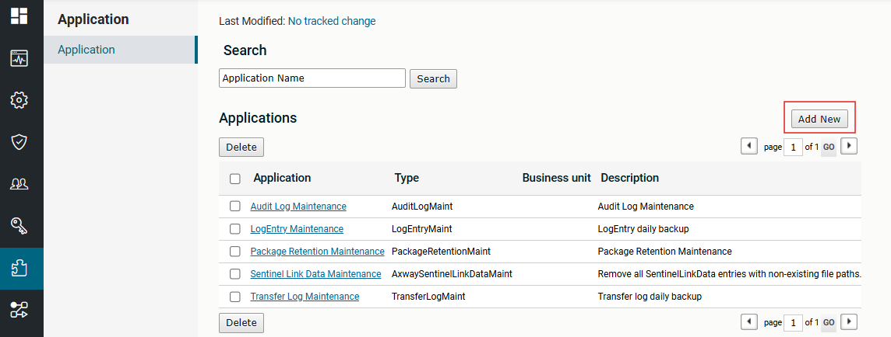

2. Navigate to *Application* and click on *Add New*

   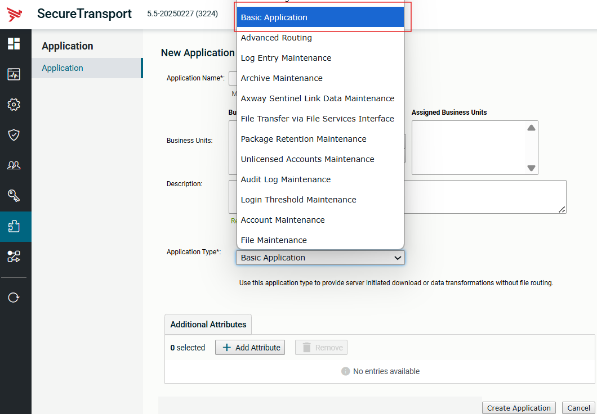

3. Select *Basic Application* from the application Type drop down menu

4. Provide a name for your application i.e. `BasicApp`

5. Select *Create Application*

---

### Task 2: Add an SSH Transfer Site to John Account

Now, we will add the file transfer flow to the John account. We will still use the web browser to upload files, but it will now transmit the files using SFTP to your instructor's server.

1. Select the John account and click the *Transfer Sites* tab

   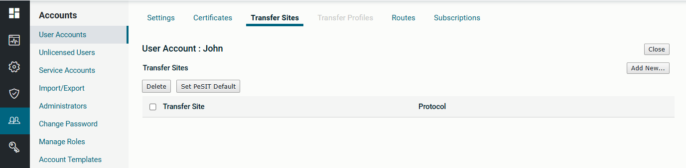

2. Click on *Add New*

3. Change the Transfer Protocol from AS2 to SSH

   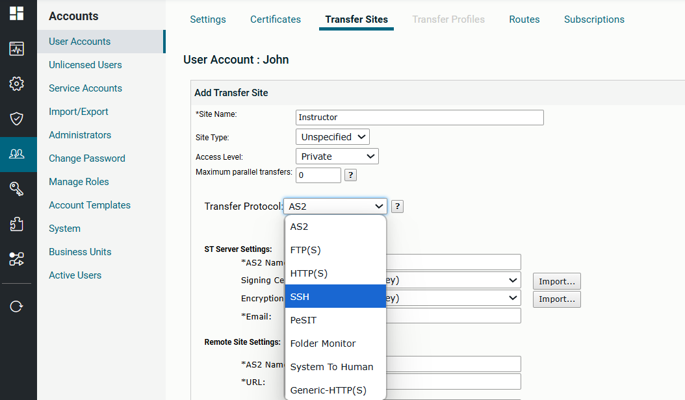

4. Configure the transfer site:

| Field | Value |
| --- | --- |
| Transfer Protocol | SSH |
| Site Name | Instructor |
| Server | galaxy1 |
| Port | 8022 |
| Upload Folder | fromStockbroker |
| User Name | axway |
| Password | axway (check the *use password* box) |

> **NOTE:** Use your **servername** as part of the upload folder – so if your server is `stockbroker`, make the upload folder `fromStockbroker` (use uppercase for the first letter of your servername).

5. Save your site using the *Add* button. The result should look like this:
   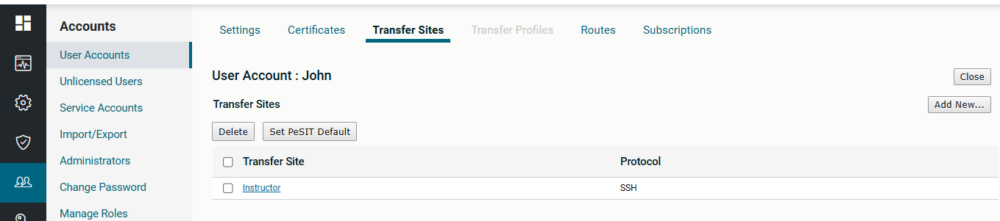

---

### Task 3: Validate Connectivity to your Instructor's Server

1. Click the *Instructor* Transfer Site to open it up again

2. Click the *Test connection* button

   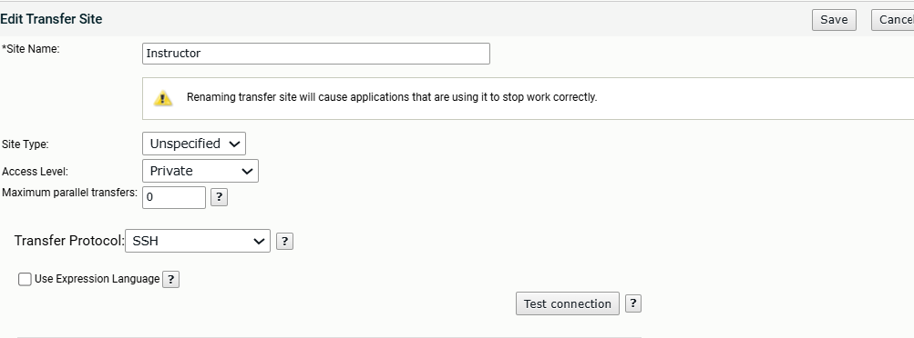

3. Verify that both connectivity AND authentication are correct; resolve any errors if required.

   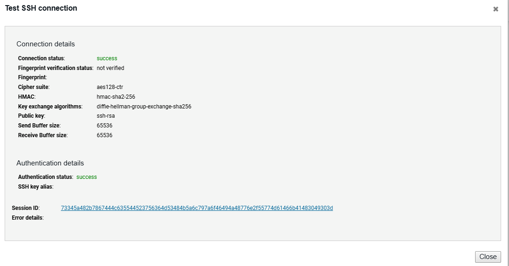

4. Check the contents of the remote upload directory by clicking *List*

   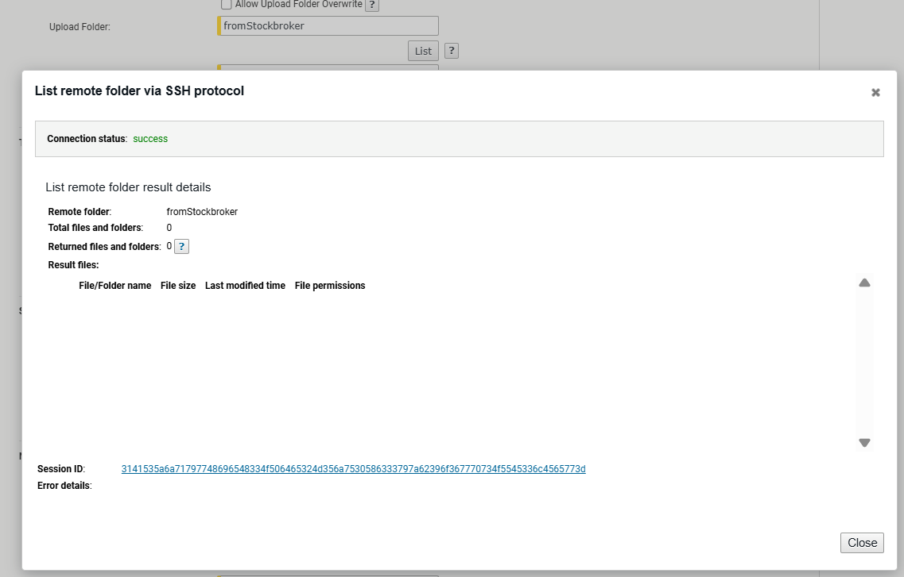

It is probably empty at this time.

---

### Task 4: Create a Subscription Folder

1. Select the *Subscriptions* tab

   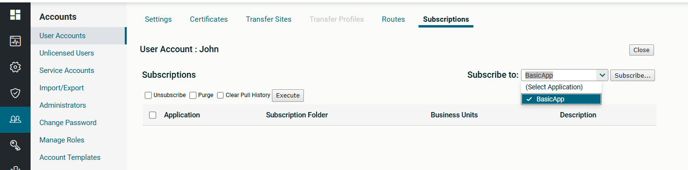

2. Select *BasicApp* from the *Subscribe to* dropdown and click *Subscribe…*

3. Change *BasicApp* to something more meaningful – perhaps `toInstructor`

   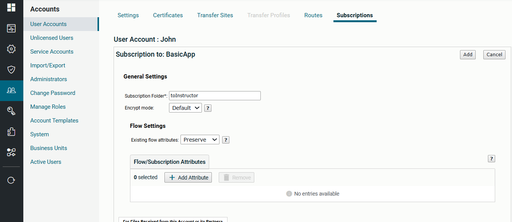

4. Scroll down to the *For Files Sent to this Account…* section (the outbound settings)

5. Check the *Send Files Directly To* box and click on the Instructor Transfer Site

6. Check the *on Success Delete* option

   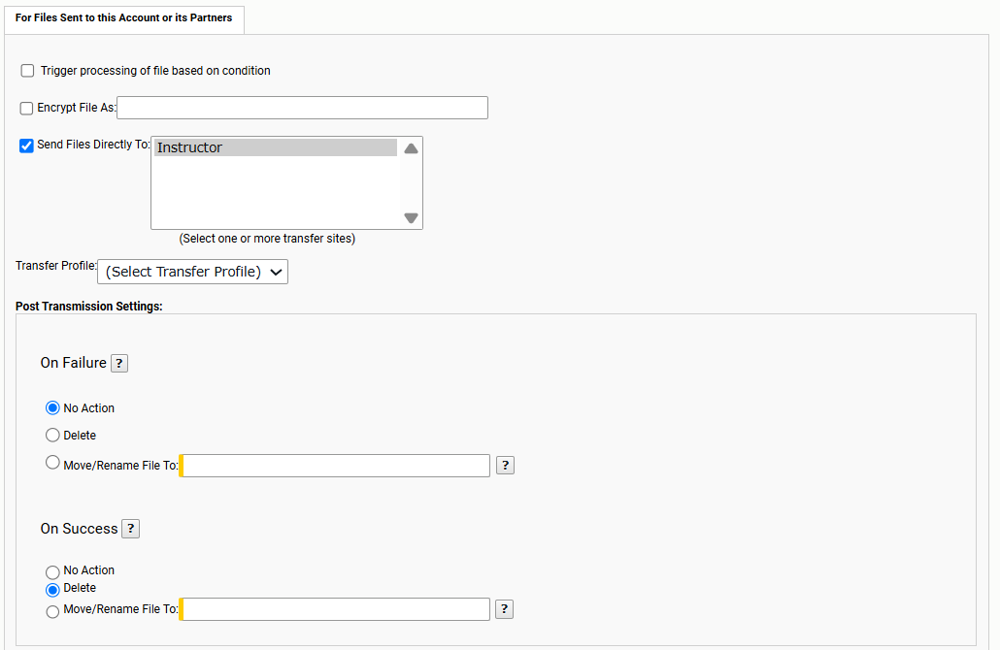

7. Save the subscription via *Add*

   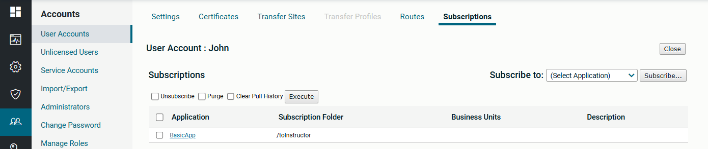

---

### Task 5: Upload a File

Any files received in the `toInstructor` folder will be transmitted to the remote server via SFTP – in this case, your instructor's server.

1. Open your web browser

2. Navigate to `https://mft-env:8443`

3. Enter `John` as the User ID

4. Enter `axway` as the Password

5. Click *Sign In*

6. Click the *toInstructor* folder

7. Upload a file (any file will do)

   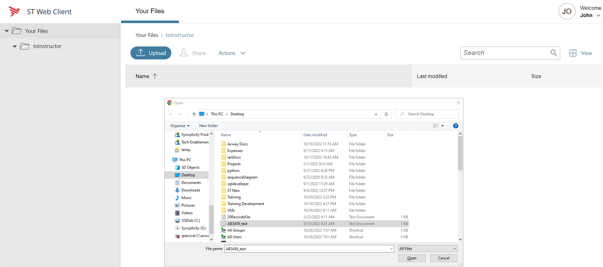

Note that on success, the file is no longer visible in the upload folder.

8. Click on the *Uploads monitor* button – you will see your file transfer

   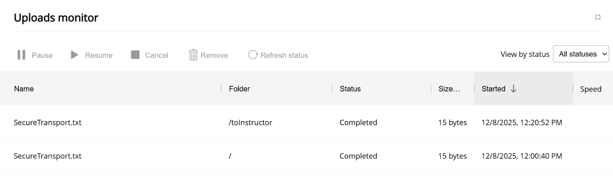

9. Login to the admin GUI and check the File Tracking

   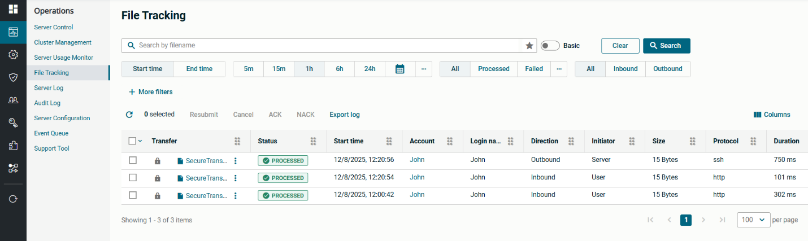

10. Open the Instructor Transfer Site attached to the John account and select *List* on the upload folder (fromStockbroker)

    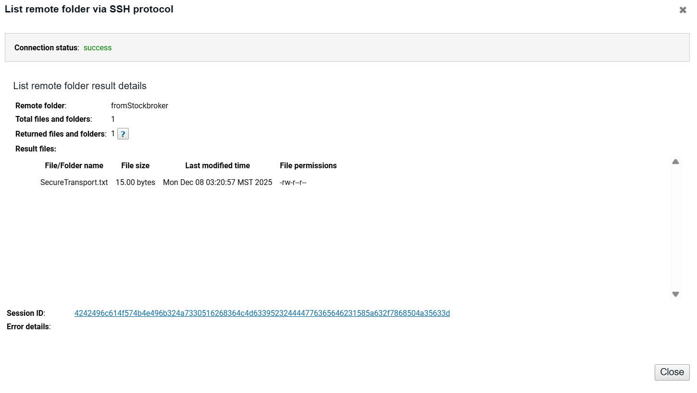

---

