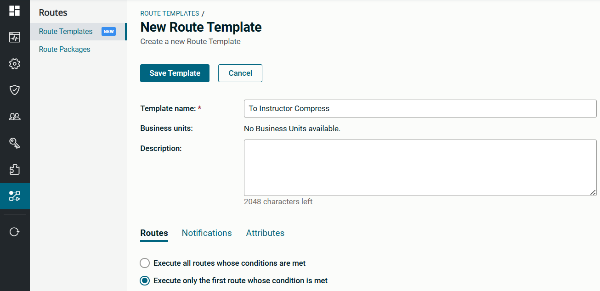
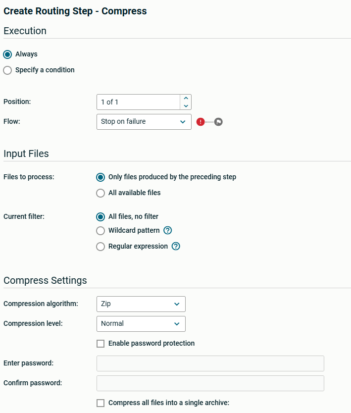
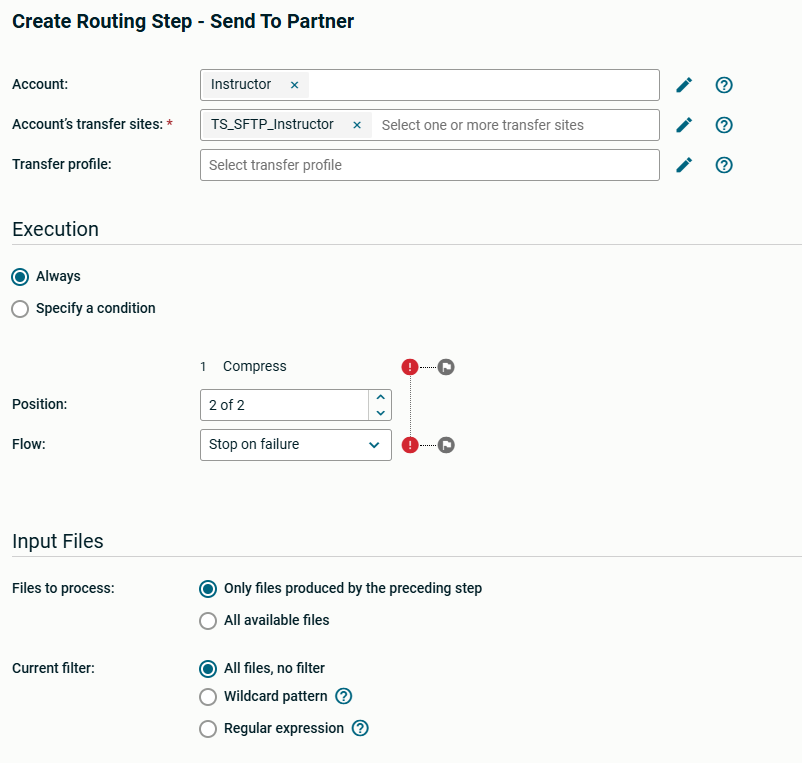
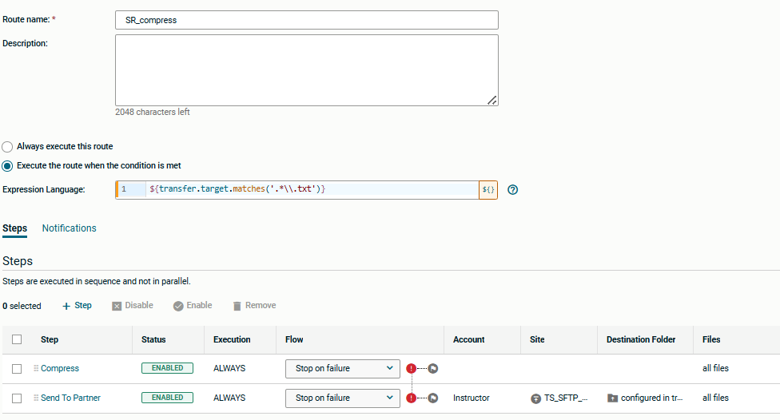
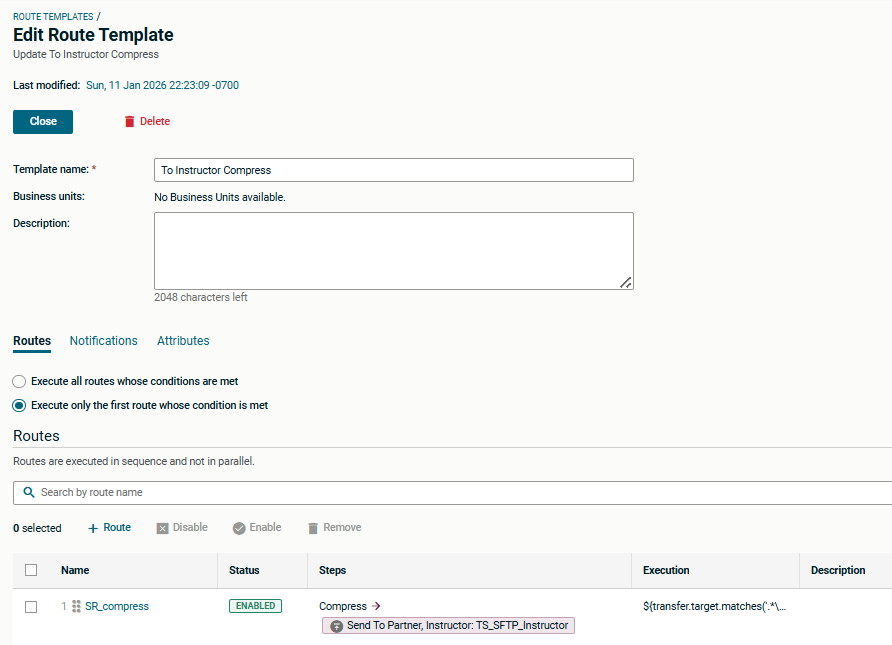
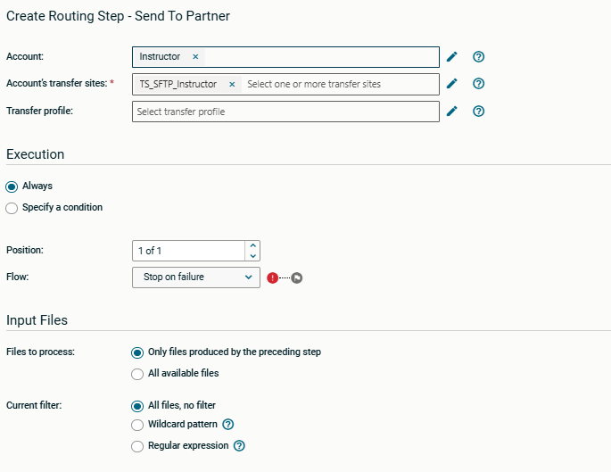
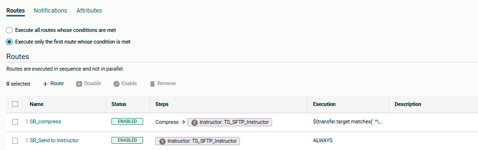
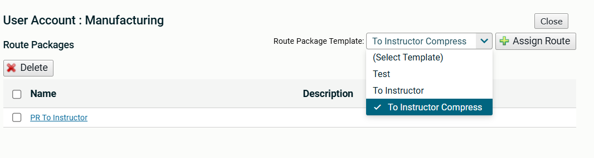
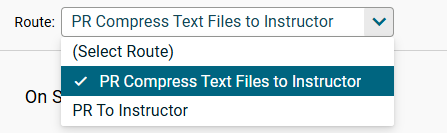
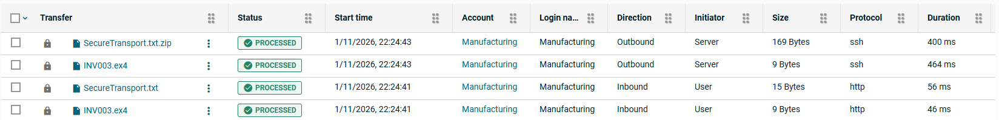

# Axway University
# SecureTransport File Flows


| Workbook Version | 1.8 |
| ---- | ---- |
| Issued | July 2026 |
| ST Server Updated | May 2026 |
| Written by | Annie Yotova |

Welcome to the SecureTransport File Flows Lab! In this hands-on workbook, you will learn how to build, manage, and troubleshoot SecureTransport file transfer flows using user accounts, subscriptions, transfer sites, advanced routing, PGP encryption, shared folders, compression, and adhoc transfers.


---

## Exercise 7 – Conditional Routing 1

### About This Exercise

In this exercise, we will route files based upon FILENAME. The Manufacturing application transmits large text-based design documents that need to be compressed. All text files will have a filename extension of `.txt`.

---

### Task 1: Create a New Route Template

1. Create a new Route Template called `To Instructor Compress`

   

2. Select *Execute only the first route whose condition is met*

3. Click *+ Add New Route*

4. Call the Route `SR_compress`

5. In the *Expression Language* field, add the following condition:

   ```text
   ${transfer.target.matches('.*\\.txt')}
   ```

**Regular expression cheat sheet:**

| Symbol | Meaning |
| --- | --- |
| `.` | Matches any symbol once. Use `..` or `.{2}` for exactly two symbols |
| `.*` | Matches any symbol zero or more times |
| `.+` | Matches any symbol one or more times |
| `\\.` | Escaped dot character (usually the start of an extension) |

6. Add the *Compress* step and uncheck *Compress All files into a single archive*

   

7. Save the step (Save Draft)

8. Add a *Send to Partner* step to transmit the file to your Instructor

   

9. Press *Save Draft*. Your route should look like this:

   

10. Click *Save Template*, then *Close*

---

### Task 2: Create a Second Route

1. Open the template you created in the previous task

   

2. Click *+ Route*

3. Provide a name for the new route – i.e. `SR_Send to Instructor`

4. Leave *Always execute this route* selected (default)

5. Add a *Send to Partner* Step (Click *+Step*)

   

6. Press *Save Draft* and *Save Template*

   

7. Click *Close*

---

### Task 3: Edit Your Manufacturing account and Add a new Route

1. Assign the *To Instructor Compress* template

   

2. Provide a route name such as `PR Compress Text Files to Instructor`

3. Save the new Route

---

### Task 4: Edit Your Subscription to Point to the New Route

1. In the `/toInstructor` subscription, change the route to the one you just created and save the subscription

   

---

### Task 5: Ask The Manufacturing Application to send test files

1. Remember that your instructor is the manufacturing application

2. Ask your instructor to send both a `.txt` file and a file with a different extension. Remind them of your server name.

3. Check the file flows for each of the received files

   

> Note that the extension `.zip` is automatically added to the filename after the text file is compressed. Any other file is not compressed – it uses the second simple route and is transmitted without change.

---
