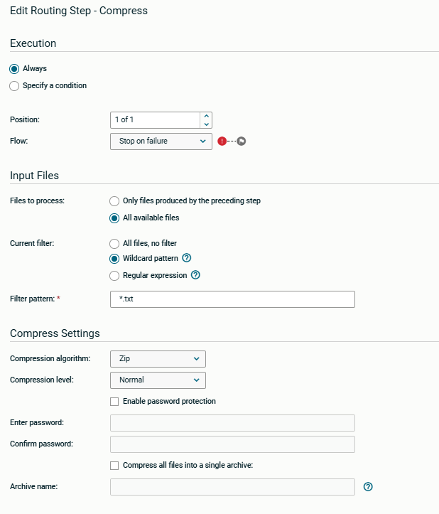
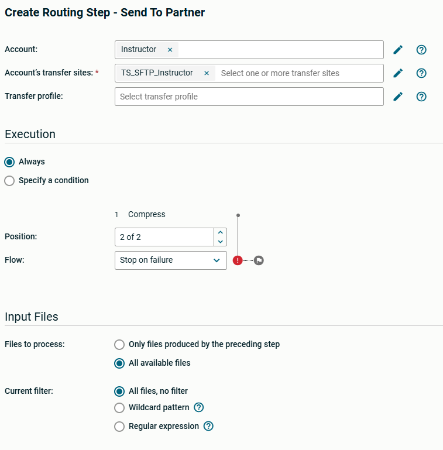
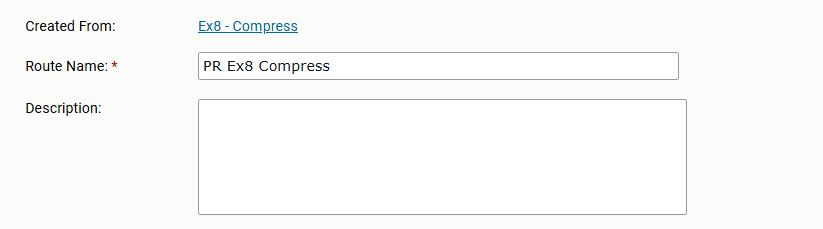
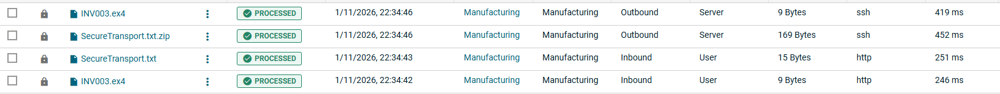

# Axway University
# SecureTransport File Flows

| Workbook Version | 1.8 |
| ---- | ---- |
| Issued | July 2026 |
| ST Server Updated | May 2026 |
| Written by | Annie Yotova |

Welcome to the SecureTransport File Flows Lab! In this hands-on workbook, you will learn how to build, manage, and troubleshoot SecureTransport file transfer flows using user accounts, subscriptions, transfer sites, advanced routing, PGP encryption, shared folders, compression, and adhoc transfers.

---

## Exercise 8 – Conditional Routing 2

### About This Exercise

We'll implement the same use case as in Exercise 7, but using a different capability of the SecureTransport server – accomplishing the requirement using a single route instead of two.

---

### Task 1: Create a New Route Template

1. Give your Route Template a name such as `Ex8 – Compress`

2. Add a New Route named `SR_Ex8`

3. Add the Compress Step

4. Uncheck the *Compress all files into a single archive* checkbox

5. In the *Current Filter* radio boxes field, select *Wildcard Pattern* and specify `*.txt` in the *Filter Pattern* field

   

The compress step will now only execute when a file pattern of `*.txt` is received.

6. Add the *Send to Partner* Step

7. Select *Stop on failure* in the *Flow* checkbox

8. Switch the *Files to process* radio box to *All available files*

   

9. Save Draft, Save Template, and Close

---

### Task 2: Create a New Route Package in the Manufacturing account

1. Create the route package with the name `PR Ex8 Compress` in the account

   

---

### Task 3: Modify the Subscription to point to the new Route

1. Modify the Manufacturing Account's subscription to point to the new package route

   

---

### Task 4: Transfer files

1. Ask your instructor to send some more files

   

> Note how the result is the same as with the previous exercise. If the files not ending in `.txt` were not sent, check that you changed *Files to process* in your route.

---

