# Axway University
# SecureTransport File Flows

| Workbook Version | 1.8 |
| ---- | ---- |
| Issued | July 2026 |
| ST Server Updated | May 2026 |
| Written by | Annie Yotova |

Welcome to the SecureTransport File Flows Lab! In this hands-on workbook, you will learn how to build, manage, and troubleshoot SecureTransport file transfer flows using user accounts, subscriptions, transfer sites, advanced routing, PGP encryption, shared folders, compression, and adhoc transfers.

---

## Exercise 10 – Decompression

### About This Exercise

We receive a zip file from our remote partner containing two types of files – Invoices (`INVxxxxx.txt`) and Orders (`ORDxxxx.txt`). Any other file received should trigger an email to our support organisation. Invoices go to Purchasing; Orders go to Sales.

---

### Task 1: Create an 'Empty' Route Template

1. Create a new Route Template called `Empty`, containing no routes (simply save with the name `Empty`)

---

### Task 2: Create an UNKNOWN account

This account will be used to send emails to our support organisation.

1. Create the UNKNOWN account

2. Make sure the Home folder Access level is set to **public** so that any other account can send files here

   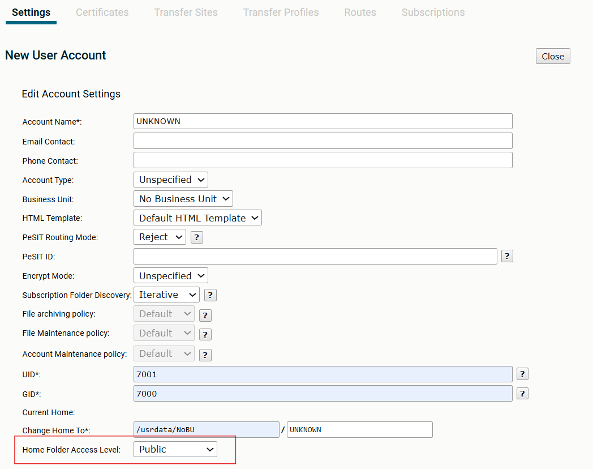

---

### Task 3: Create the UNKNOWN account's Package Route

1. Create a new Package Route that uses the `Empty` Route Template

2. Name the Package Route `PR_Send_Email`

3. Click *Notify Emails on Route Triggering*

4. Enter the email `studentxx@demo.axway.com` (where `xx` is your student number)

5. Use the *RoutingTriggered* Notification template

   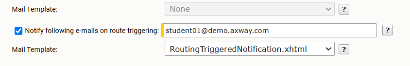

---

### Task 4: Create the UNKNOWN account's Subscription

Use the Advanced Routing Application.

1. Change the subscription folder to be the Home folder of the account (indicated with `/`)

2. Select the `PR_Send_Email` Route

   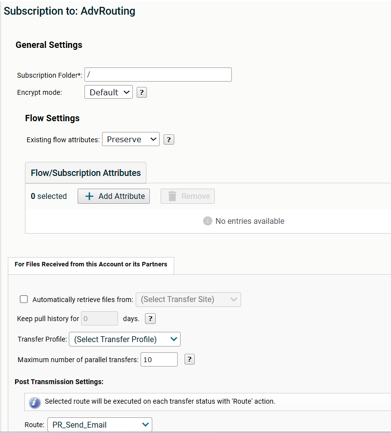

---

### Task 5: Create the two target accounts

We need two more accounts – SALES and PURCHASING.

1. Create a `Sales` Account (use any password you like)

   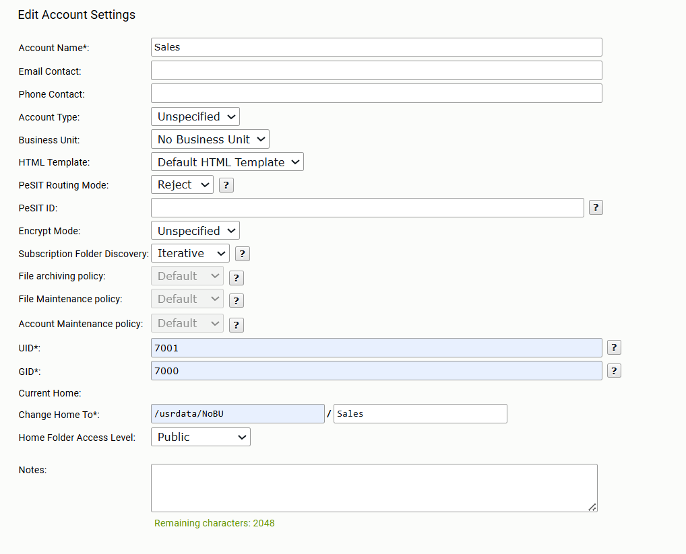

> **Reminder:** Make sure that you set the Home Folder Access Level to Public.

2. Similarly, create a `Purchasing` Account (you can use *Duplicate* account – make sure to enable it afterwards)

   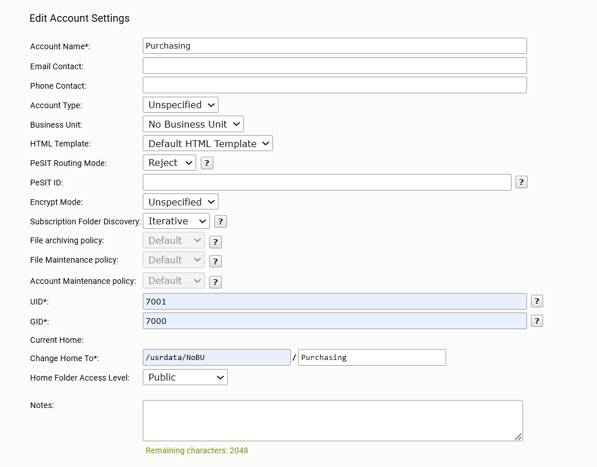

---

### Task 6: Create the File Processing account

This account receives the incoming files from your partner – we'll call it Partner1.

1. Provide a password of `axway`

   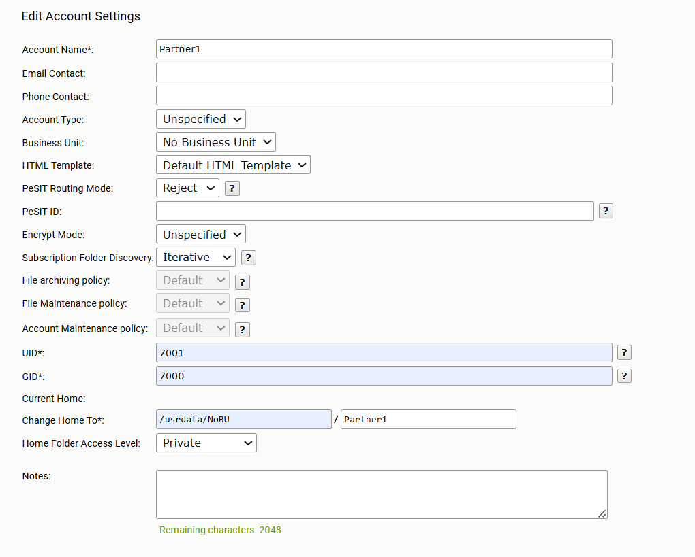

---

### Task 7: Create the Decompress Route Template

1. Provide a Name of `Partner1 Decompress`

2. Add a Simple route called `SR_Decompress`

3. Add a Decompress Step

4. Change the *Flow* drop down to *Stop on Failure*

   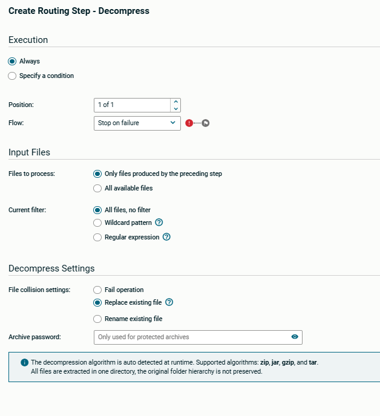

5. Add a *Publish to account* step to send Invoices to the `Purchasing` account

   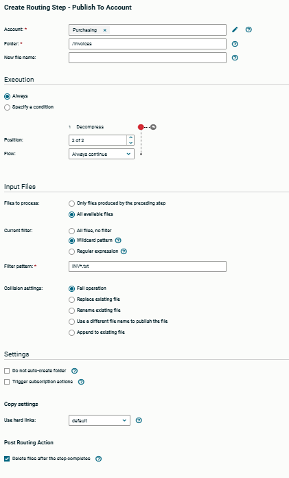

6. Add another Step to send Orders to the Sales Department

   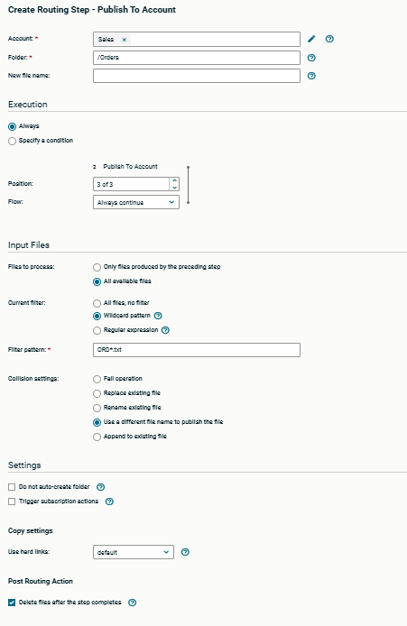

7. Add a final *Publish to account* step sending any other files to the `UNKNOWN` account

   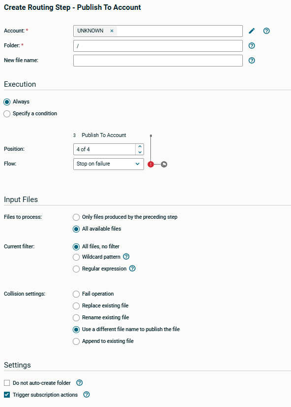

> Note the *Files to Process* setting.

---

### Task 8: Edit the Partner1 account and add the route

1. Assign the route and call the Package route `PR_decompress`

---

### Task 9: Add the receiving Subscription Directory

1. Add a subscription to the Advanced Routing application

2. Change the subscription folder to `/fromPartner1`

3. Select the `PR_decompress` Route

4. Make sure you *Delete* the files after a successful transmission

---

### Task 10: SMTP settings

If you reinstalled SecureTransport as part of your class, the mail server is not configured. Check the *SMTP group* in the *Server Configuration* menu and make sure the parameters are filled in.

   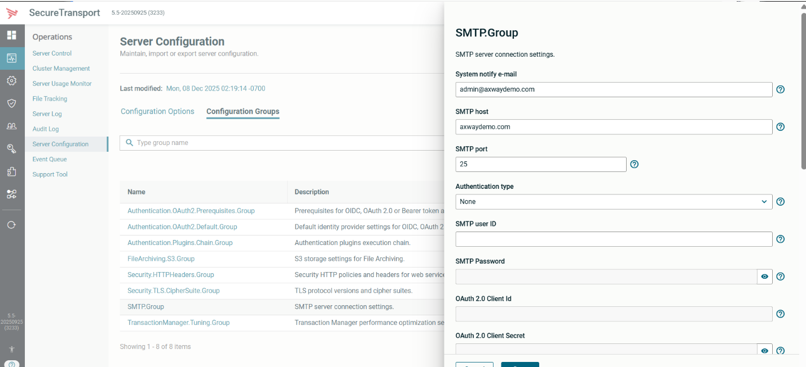

---

### Task 11: Receive the Files

1. Initiate the flow by submitting files yourself or ask your instructor to send you a zip file. Files are located in `STSOURCE/EX10`.

   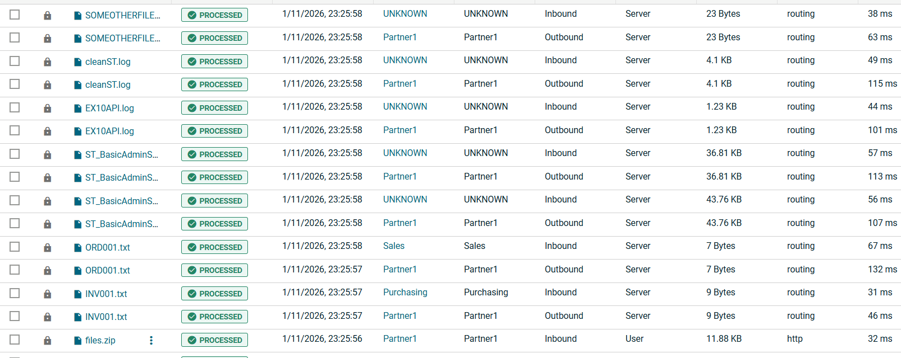

2. Check your email at `https://mft-env:10033`

3. Login to the demo web mail server as `studentxx` / password `studentxx` (where `xx` is your student number)

4. You will see the email:

   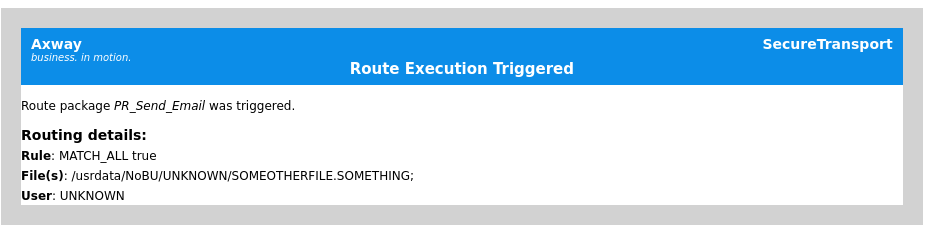

> If you do not see the email, inspect your ST server logs, resolve any errors, then execute your flow again.

---

