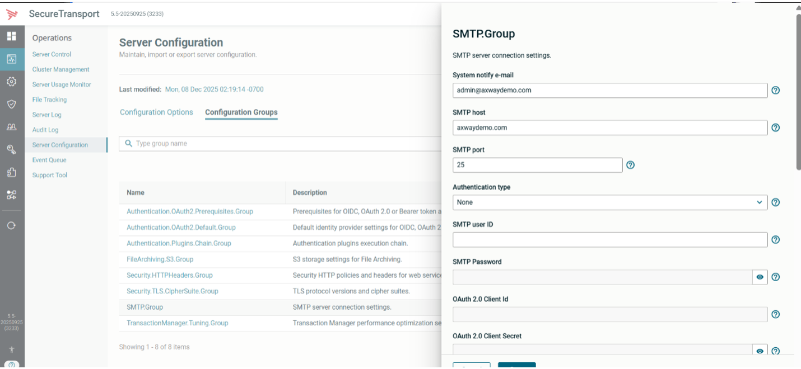
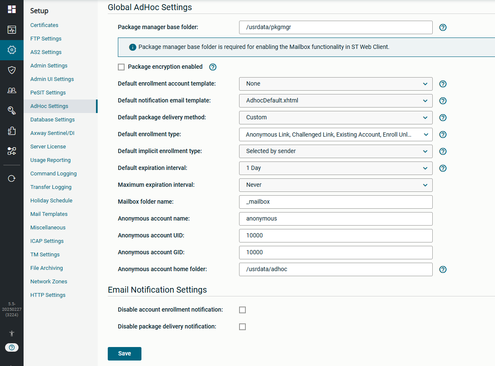
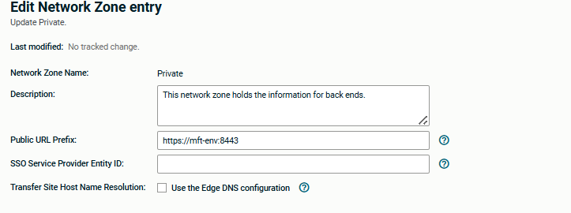
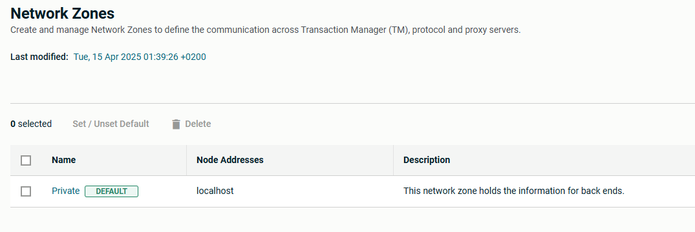
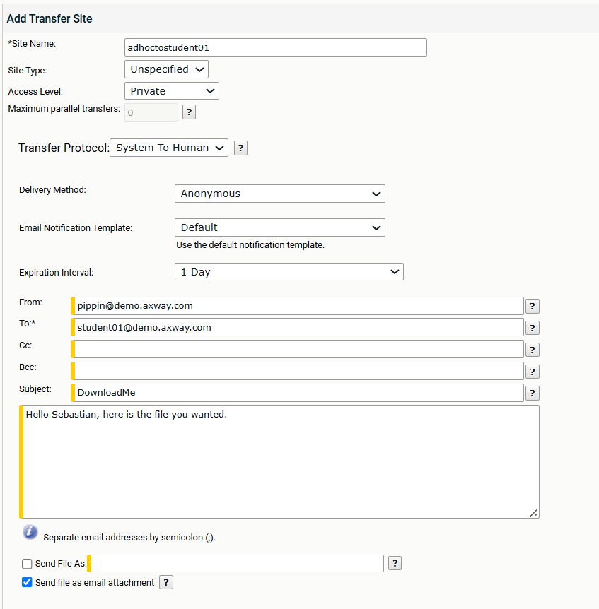
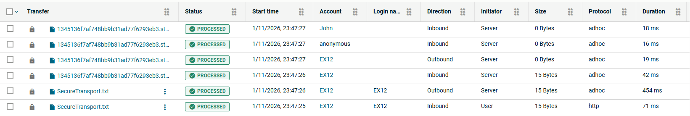
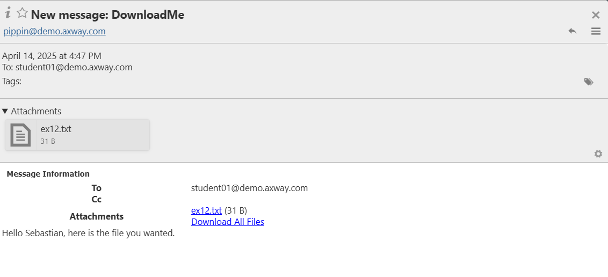

# Axway University
# SecureTransport File Flows

| Workbook Version | 1.8 |
| ---- | ---- |
| Issued | July 2026 |
| ST Server Updated | May 2026 |
| Written by | Annie Yotova |

Welcome to the SecureTransport File Flows Lab! In this hands-on workbook, you will learn how to build, manage, and troubleshoot SecureTransport file transfer flows using user accounts, subscriptions, transfer sites, advanced routing, PGP encryption, shared folders, compression, and adhoc transfers.

---

## Exercise 12 – Adhoc Flows 1

### About This Exercise

In this exercise, we'll use the System to Human transfer site. An ST user wishes to transmit a file to someone outside the organisation who is not registered as an ST user. An email will be sent containing a link from which they can download their file.

---

### Task 1: Check Email and Adhoc settings

1. Verify the SMTP settings in **Server Configuration → SMTP Group** are active

   

2. Check that your **Setup → Adhoc** settings are correct

   

> **NOTE:** In the *Default Enrollment Type*, select all but *Enroll Licensed*.

3. Check your private network zone has the correct public URL setting

   

4. Also check that the Network zone is defined as the default

   

---

### Task 2: Create your sending account

1. Create a new account called `EX12`

---

### Task 3: Create a System to Human Transfer Site

1. Change the *To:* email to be the email associated with your system (e.g. `student01`, `student02`)

2. We are using the *anonymous* delivery method – the remote user has no registration within SecureTransport

3. The *Send As an attachment* option has a size limit. If unchecked, the recipient will receive an anonymous download link.

   

---

### Task 4: Create a Basic Subscription to use the Transfer Site

> **NOTE:** You can also use Advanced Routing if you want to transform the file before sending it.

---

### Task 5: Initiate the transfer

1. Login via the web browser to account `EX12`

2. Upload a file in the subscription folder you created in Task 4

---

### Task 6: Check the File Tracking

1. Notice that your file has been moved to the anonymous account as a package

   

> As the email belongs to an existing account, the message was also delivered to that account.

---

### Task 7: Login to the Email Server

1. Navigate to `https://mft-env:10033`

2. Login as your recipient email (e.g. `student01`, `student02`)

3. You should see an email with an attachment

   

4. Click on the link to download the file

> Downloading from either link will show up as an outbound HTTPS transfer in ST. Downloading the attachment directly from mail will not show as an additional transfer.

---
